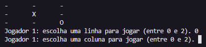

# Some Academic Projects I Assisted
 ## Languages
 This first section is in English. 
 
 [Versão em português logo abaixo.](#portuguese)
 
 ## Context
 Codes developed for the courses of my **Computer Science Emphasis** at the **University of São Paulo - USP** (*Institute of Mathematical and Computer Sciences - ICMC*) - university level.

The codes in this repository are some exercises and university work done in some of these courses.

The courses included in this repository are:
- [ICC1 - Introduction to Computer Science 1 (old discipline)](./icc1-old/)
- [ICC1 - Introduction to Computer Science 1](./icc1/)
- [Lab. ICC1 - Introduction to Computer Science 1 Laboratory](./Lab-icc1/)
- [ICC2 - Introduction to Computer Science 2](./icc2/)
 
 ## Some highlights
Some codes I developed that I believe deserve to be highlighted:

### Tic-tac-toe
Developed in the **ICC1 (old)** discipline, it is a [tic-tac-toe code](./icc1-old/challenges/Tic-tac-toe_with_X_O.c) in which each player chooses the position of the row and column using the keyboard to play.

<p align="center">

</p>

### Battleship Game
Developed in the **ICC1 (old)** discipline, it is a [Battleship game code](./icc1-old/practice/Work/Naval_Battle_JV_HR_ready.c), with the option of one or two players, in which each player chooses the position of the row and column using the keyboard to play.

I made this game with my friend ```Hingryd Rauen```.

<p align="center">

</p><br>
<p align="center">

</p><br>
<p align="center">

</p><br>
<p align="center">

</p>

 ## How to access these codes
To access these undergraduate discipline codes, access the respective course paths in this repository.
 
 ## Technologies used
In these codes, the ```C``` programming language was used.
 
 ____
 <br>
 
 # <p id="portuguese">Códigos que eu fiz em disciplinas da graduação</p>
 ## Contexto
 Códigos desenvolvidos para as disciplinas da minha **Ênfase em Computação** pela **Universidade de São Paulo - USP** (*Instituto de Ciências Matemáticas e de Computação - ICMC*) - de nível universitário.

 Os códigos deste repositório são alguns exercícios e trabalhos feitos em algumas dessas disciplinas.

 As disciplinas que inclui neste repositório são:
 - [ICC1 - Introdução à Ciência da Computação 1 (antigo)](./icc1-old/)
 - [ICC1 - Introdução à Ciência da Computação 1](./icc1/)
 - [Lab. ICC1 - Laboratório de Introdução à Ciência da Computação 1](./Lab-icc1/)
 - [ICC2 - Introdução à Ciência da Computação 2](./icc2/)

 ## Alguns destaques
 Alguns códigos que desenvolvi que acredito merecerem destaque:

 ### Jogo da velha
Desenvolvido na disciplina de **ICC1 (antigo)**, é um [código de jogo da velha](./icc1-old/desafios/Jogo_da_velha_com_X_O.c) em que cada jogador escolhe a posição da linha e da coluna pelo teclado para fazer a jogada.

 <p align="center">
   
 </p>

 ### Jogo Batalha Naval
 Desenvovido na disciplina de **ICC1 (antigo)**, é um [código de jogo de batalha naval](./icc1-old/prática/Trabalho/Batalha_Naval_JV_HR_pronto.c), com opção de um ou dois jogadores, em que cada jogador escolhe a posição da linha e da coluna pelo teclado para fazer a jogada.

 Jogo feito com minha amiga ```Hingryd Rauen```.

<p align="center">
   
 </p><br>
 <p align="center">
   
 </p><br>
 <p align="center">
   
 </p><br>
 <p align="center">
   
 </p>
 
 ## Instruções de acesso
 Para acessar os códigos das disciplinas, acesse neste repositório os respectivos caminhos das disciplinas.
 
 ## Tecnologias utilizadas
 Nestes códigos, foi utilizada a linguagem ```C``` de programação.